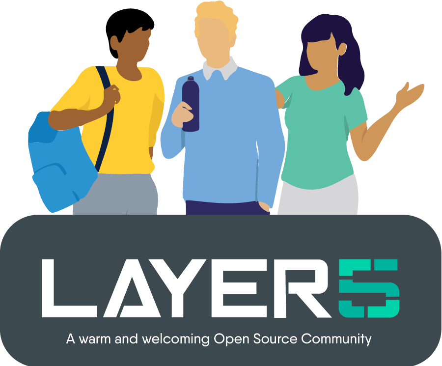

<h1 align="center">Service Mesh Patterns</h1>

    

<h5>
<i>If you’re using this project or simply like its concept, please <a href="https://github.com/layer5io/meshery/stargazers">★</a> this repository to show your support! 🤩</i>
</h5>

This repository contains a collection of functional examples to be used as patterns for operationalizing cloud native infrastruture and application deployments and applying best practices.

A service mesh is a layer in your infrastructure that facilitates communication between services… and so much more. Its value is enormous, and the value you derive from one is very much related to what role you play in the design, implementation, and operations of your cloud native applications and infrastructure. Service mesh patterns help you get the most out of Linkerd, Consul, App Mesh, Istio, Kuma, Open Service Mesh or <a href="https://layer5.io/service-mesh-landscape">any service mesh</a>, including those using Envoy and use of WebAssembly. Each pattern can be used as a template and is customizable. 

## What are Service Mesh Patterns?
This feature area is under active development. Until additional documentation is published, see <a href="https://docs.google.com/document/d/1B2N78EdRiZF-yVo1-HY3syppwBBDumgMuYg6seD-AJ4/edit#"> the Meshery and Service Mesh Patterns</a> design specification for further details.

## Prototyping Pattern Files and their Orchestration
Interpreting Pattern files in Meshery

    

&nbsp;

## Join the service mesh community!

Our projects are community-built and welcome collaboration. 👍 Be sure to see the <a href="https://docs.google.com/document/d/17OPtDE_rdnPQxmk2Kauhm3GwXF1R5dZ3Cj8qZLKdo5E/edit">Layer5 Community Welcome Guide</a> for a tour of resources available to you and jump into our <a href="http://slack.layer5.io">Slack</a>!

<h3>Find your MeshMate</h3>

MeshMates are experienced Layer5 community members, who will help you learn your way around, discover live projects and expand your community network. 
Become a <b>Meshtee</b> today!

Find out more on the <a href="https://layer5.io/community">Layer5 community</a>.  

&nbsp;

✔️ <em><strong>Join</strong></em> any or all of the weekly meetings on <a href="https://calendar.google.com/calendar/b/1?cid=bGF5ZXI1LmlvX2VoMmFhOWRwZjFnNDBlbHZvYzc2MmpucGhzQGdyb3VwLmNhbGVuZGFyLmdvb2dsZS5jb20">community calendar</a>. 
✔️ <em><strong>Watch</strong></em> community <a href="https://www.youtube.com/playlist?list=PL3A-A6hPO2IMPPqVjuzgqNU5xwnFFn3n0">meeting recordings</a>. 
✔️ <em><strong>Access</strong></em> the <a href="https://drive.google.com/drive/u/4/folders/0ABH8aabN4WAKUk9PVA">Community Drive</a> by completing a community <a href="https://layer5.io/newcomer">Member Form</a>. 
✔️ <em><strong>Discuss</strong></em> in the <a href="https://discuss.layer5.io">Community Forum</a>. 

<i>Not sure where to start?</i> Grab an open issue with the <a href="https://github.com/issues?q=is%3Aopen+is%3Aissue+archived%3Afalse+org%3Alayer5io+org%3Ameshery+org%3Aservice-mesh-performance+org%3Aservice-mesh-patterns+label%3A%22help+wanted%22+">help-wanted label</a>.

