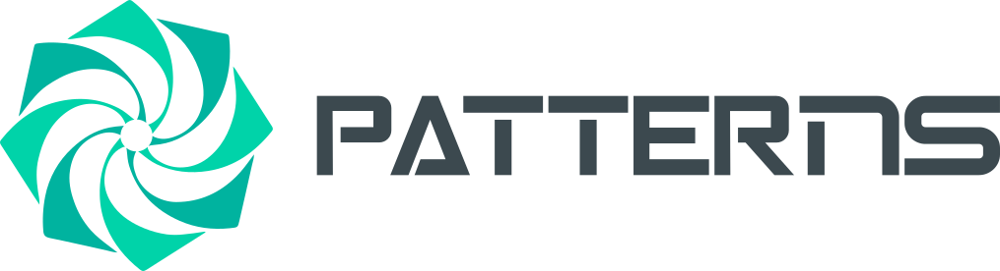
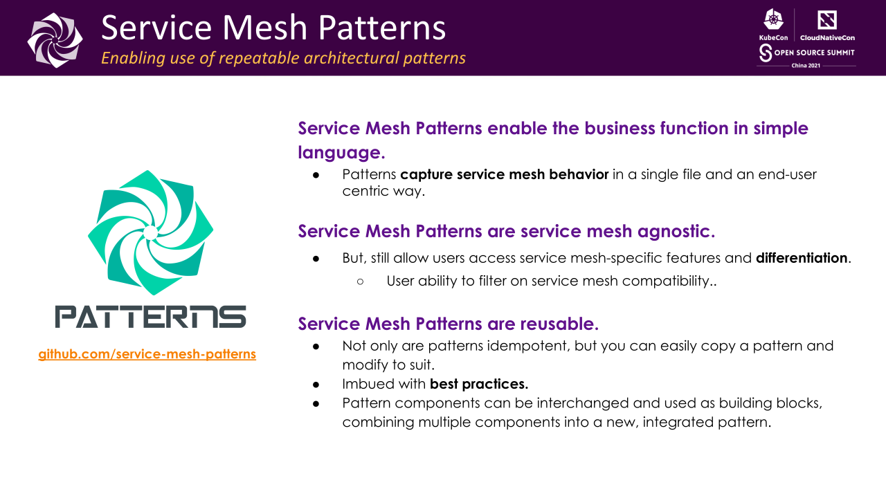
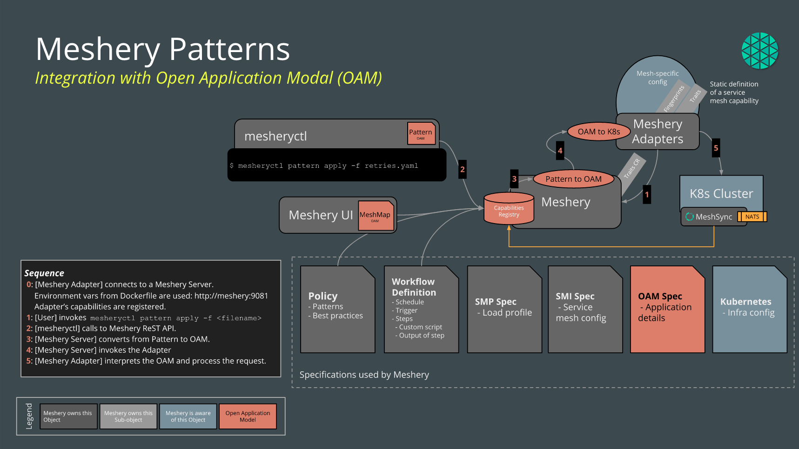
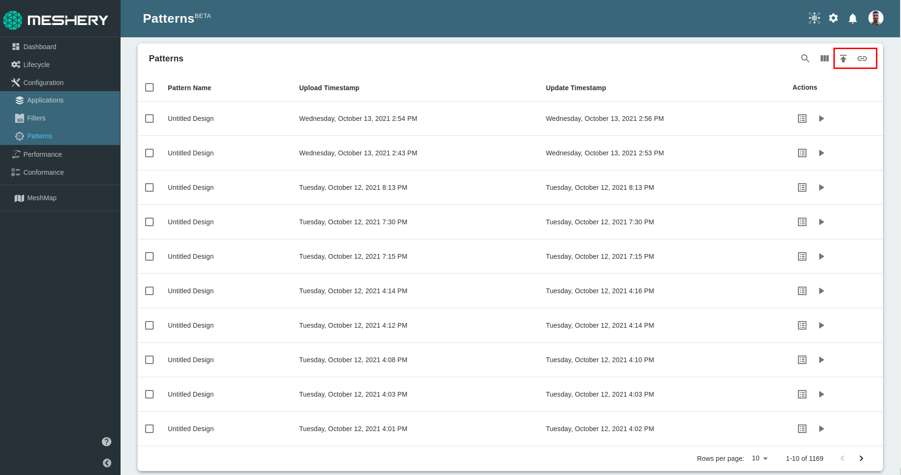
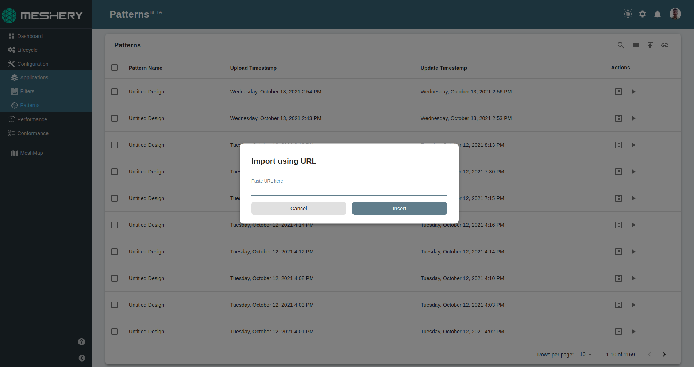

<div align="center">
<h1 align="center">Service Mesh Patterns</h1>
</div>
<p align="center">
<picture align="center">
<source media="(prefers-color-scheme: dark)" srcset=".github/readme/images/logo_with_text_white.svg" width="70%" align="center" style="margin-bottom:20px;">
<source media="(prefers-color-scheme: light)" srcset=".github/readme/images/logo_with_text_black.svg" width="70%" align="center" style="margin-bottom:20px;">

</p>

<h5><p align="center"><i>If you’re using this project or simply like its concept, please <a href="https://github.com/layer5io/meshery/stargazers">★</a> this repository to show your support! 🤩</i></p></h5>

This repository contains a collection of functional examples to be used as patterns for operationalizing cloud native infrastructure and application deployments and applying best practices.

A service mesh is a layer in your infrastructure that facilitates communication between services… and so much more. Its value is enormous, and the value you derive from one is very much related to what role you play in the design, implementation, and operations of your cloud native applications and infrastructure. Service mesh patterns help you get the most out of Linkerd, Consul, App Mesh, Istio, Kuma, Open Service Mesh or <a href="https://layer5.io/service-mesh-landscape">any service mesh</a>, including those using Envoy and use of WebAssembly. Each pattern can be used as a template and is customizable.

## What are Service Mesh Patterns?

This feature area is under active development. Until additional documentation is published, see <a href="https://docs.google.com/document/d/1B2N78EdRiZF-yVo1-HY3syppwBBDumgMuYg6seD-AJ4/edit#"> the Meshery and Service Mesh Patterns</a> design specification for further details.

<p align="center">
    
</p>

## Prototyping Pattern Files and their Orchestration

Interpreting Pattern files in Meshery

<p align="center">
    
</p>

<div>&nbsp;</div>

## Using Meshery to Deploy a Service Mesh Pattern

You can use Meshery to deploy a service mesh pattern. Service mesh patterns are detailed as a YAML file.
See the <a href="https://docs.meshery.io/guides/configuration-management">Configuration Management</a> guide.

### Pattern Repository

You may bring your own patterns or find them available through your chosen provider. Each service mesh pattern carries a unique identifier for reference.

For Further detailed information, you can have a look at <a href="https://docs.meshery.io/functionality/pattern-management#pattern-repository">Pattern Repository Section</a>

## Importing Patterns

You can import a pattern using `mesheryctl` or Meshery UI. Patterns can be imported from your local filesystem, an HTTP/S endpoint, or from GitHub. When provided a GitHub location (org/repo), Meshery will recursively search the given directory (or the entire repository) for existing pattern files.

### Using Meshery CLI

### To import a pattern,execute this command:

```
$ mesheryctl pattern import -f <path to the pattern>
Importing pattern…
Pattern successfully imported.
```

### Using Meshery UI:

From Meshery UI, patterns can be imported from your local filesystem or imported from a remote URL.

<p align="center">
    
</p>

To upload from url click the link icon

<p align="center">
    
</p>

In case of any doubts and clarifications, you can always have a look at the <a href="https://docs.meshery.io/">Meshery Documentation</a>

## Join the service mesh community!

<a name="contributing"></a><a name="community"></a>

Our projects are community-built and welcome collaboration. 👍 Be sure to see the <a href="https://layer5.io/community/newcomers">Layer5 Newcomers' Guide</a> for a tour of resources available to you and jump into our <a href="http://slack.layer5.io">Slack</a>!

<p align="center">
  <a href="https://layer5.io/community/meshmates">
    
  </a>
</p>

<h3 align="center">Find your MeshMate</h3>

<p align="center" style="max-width: 800px; margin: 0 auto;">
  <strong>MeshMates</strong> are experienced Layer5 community members who help you learn your way around,
  discover live projects, and expand your community network.<br>
  Become a <b>Meshtee</b> today!
</p>

<p align="center">
  Find out more on the <a href="https://layer5.io/community">Layer5 community</a>.
</p>

---


<p>
✔️ <strong>Join</strong> any or all of the weekly meetings on the <a href="https://calendar.google.com/calendar/b/1?cid=bGF5ZXI1LmlvX2VoMmFhOWRwZjFnNDBlbHZvYzc2MmpucGhzQGdyb3VwLmNhbGVuZGFyLmdvb2dsZS5jb20">community calendar</a>.<br/>
✔️ <strong>Watch</strong> community <a href="https://www.youtube.com/playlist?list=PL3A-A6hPO2IMPPqVjuzgqNU5xwnFFn3n0">meeting recordings</a>.<br/>
✔️ <strong>Access</strong> the <a href="https://drive.google.com/drive/u/4/folders/0ABH8aabN4WAKUk9PVA">Community Drive</a> by completing a community <a href="https://layer5.io/newcomer">Member Form</a>.<br/>
✔️ <strong>Discuss</strong> in the <a href="https://discuss.layer5.io">Community Forum</a>.<br/>
✔️ <strong>Explore</strong> more in the <a href="https://layer5.io/community/handbook">Community Handbook</a>.<br/>
</p>

<p align="center"><i>Not sure where to start? Grab an open issue with the <a href="https://github.com/issues?q=is%3Aopen+is%3Aissue+archived%3Afalse+org%3Alayer5io+org%3Ameshery+org%3Aservice-mesh-performance+org%3Aservice-mesh-patterns+label%3A%22help+wanted%22+">help-wanted label</a>.</i></p>
